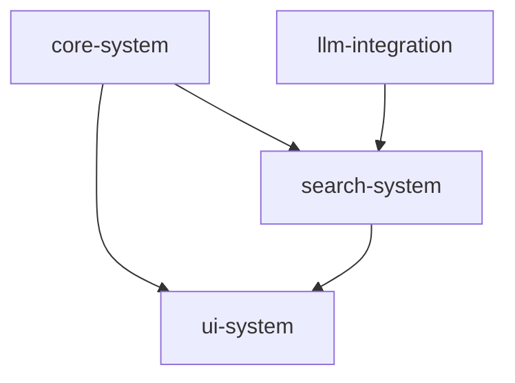

# Current Status

> **Module System - Hierarchical Modules with Wiki-Style Connections**

Last Updated: 2025-11-15

---

## Overview

Knowledge organization system with:
- **Hierarchical Modules:** Directory-based structure with parent-child relationships
- **Wiki Connections:** [[link]] syntax for cross-references
- **Graph Database:** SQLite-based connection tracking
- **AI Suggestions:** LLM-powered connection recommendations

**Status:** ✅ COMPLETE (Phase 6)

---

## Phase 6: Hierarchical Modules + Wiki Connections (COMPLETE)

### Hierarchical Structure ✅

**Implementation:**
- Directory-based hierarchy (e.g., `projects/website/backend`)
- `current.md` as module marker
- Recursive module discovery
- Tree visualization

**Commands:**
- `mmodule create <path>` - Create new module
- `mmodule list` - List all modules
- `mmodule tree` - Display hierarchy tree
- `mmodule archive <name>` - Archive module
- `mmodule unarchive <name>` - Unarchive module

**Key Files:**
- `memory_tool/core/module.py`
- `.memory/modules/` (module root)

**Directory Structure:**
```
.memory/modules/
├── projects/
│   └── memory-tool/
│       ├── core-system/
│       │   ├── current.md       # Module marker
│       │   ├── module.md        # Module metadata
│       │   └── decisions.md     # Module decisions
│       ├── search-system/
│       └── ui-system/
└── concepts/
```

### Wiki-Style Connections ✅

**Implementation:**
- `[[module-name]]` link syntax
- Automatic link detection
- Bidirectional connections (outgoing + incoming)
- SQLite connection graph (`.memory/.connections.db`)

**Link Format:**
```markdown
See also [[projects/memory-tool/search-system]] for search details.
```

**Key Files:**
- `memory_tool/core/connections.py`
- `.memory/.connections.db`

### Connection Graph ✅

**Database Schema:**
```sql
CREATE TABLE connections (
    id INTEGER PRIMARY KEY,
    source_module TEXT,      -- Module containing the link
    target_module TEXT,      -- Module being linked to
    link_text TEXT,          -- Original [[link]] text
    file_path TEXT,          -- File containing the link
    line_number INTEGER,     -- Line number of link
    created_at TIMESTAMP
);
```

**Commands:**
- `mmodule connections <module>` - Show module connections
- `mmodule graph` - Show full connection graph
- `mmodule rebuild-graph` - Rebuild connection database
- `mmodule check-links` - Find broken links

**Key Features:**
- Orphaned module detection
- Broken link validation
- Connection statistics

### Graph Visualization ✅

**Export Formats:**
- **Mermaid:** For GitHub/docs rendering
- **Graphviz:** For DOT/PNG generation

**Commands:**
```bash
mmodule graph --format mermaid       # Mermaid diagram
mmodule graph --format graphviz      # DOT format
mmodule graph --output graph.md      # Save to file
```

**Example Mermaid Output:**


### Link Validation ✅

**Broken Link Detection:**
- Scans all `[[links]]` in module files
- Checks if target module exists
- Reports missing modules with source location

**Commands:**
```bash
mmodule check-links                  # Check all links
mmodule check-links <module>         # Check specific module
```

### Connection Suggestions ✅

**Rule-Based Suggestions:**
- Path similarity (shared parent paths)
- Category matching (same tags/categories)
- Common target analysis (modules linking to same targets)

**Commands:**
```bash
mmodule suggest-links <module>       # Suggest connections
```

**Key Files:**
- `memory_tool/core/connections.py` (suggestion algorithms)

### AI-Based Suggestions ✅

**LLM-Powered Features:**
- Content similarity analysis
- Connection suggestions with confidence scores
- Automatic tagging

**Commands:**
```bash
mmodule suggest-ai <module>          # AI-based suggestions
mmodule auto-tag <module>            # Generate tags
```

**Implementation:**
- Uses [[projects/memory-tool/llm-integration]] for LLM access
- Analyzes module content (current.md, decisions.md)
- Provides reasoning for suggestions

**Key Files:**
- `memory_tool/core/ai_suggester.py`

### Graph Version Management ✅

**Snapshot System:**
- SQLite-based version storage
- Automatic versioning on rebuild
- Version comparison and diff

**Commands:**
```bash
mmodule graph-snapshot              # Create snapshot
mmodule graph-history               # View version history
mmodule graph-diff <v1> <v2>        # Compare versions
```

**Use Cases:**
- Track knowledge graph evolution
- Understand connection changes
- Audit module relationships

**Key Files:**
- `memory_tool/core/graph_versions.py`
- `.memory/.connections.db` (versions table)

### Git Hooks Integration ✅

**Automatic Sync:**
- Pre-commit: Rebuild graph before commit
- Post-checkout: Rebuild graph after checkout

**Commands:**
```bash
mmodule hooks install               # Install git hooks
mmodule hooks uninstall             # Remove git hooks
mmodule hooks list                  # List hook status
```

**Implementation:**
- `GitHookManager` class
- Hooks written to `.git/hooks/`
- Safe: checks for existing hooks

**Key Files:**
- `memory_tool/utils/git_hooks.py`

---

## Configuration

**config.yaml settings:**
```yaml
modules:
  auto_rebuild_graph: true          # Auto-rebuild on module changes
  connection_suggestions: 5         # Max suggestions to show
  graph_version_auto: true          # Auto-snapshot on rebuild
```

---

## Dependencies

**Depends on:**
- [[projects/memory-tool/core-system]] - Module file structure
- [[projects/memory-tool/llm-integration]] - AI suggestions
- [[projects/memory-tool/search-system]] - Module content search

**Depended on by:**
- [[projects/memory-tool/ui-system]] - Module browser TUI

---

## Key Decisions

See [[projects/memory-tool/project-management/decisions]]:
- Decision #13: Directory-based hierarchy
- Decision #14: current.md as module marker
- Decision #15: Wiki-style [[links]] for connections
- Decision #16: SQLite for connection graph
- Decision #17: Mermaid + Graphviz exports
- Decision #18: Git hooks for auto-sync
- Decision #19: AI-based connection suggestions
- Decision #20: Graph versioning system

---

## Metrics

**Module System:**
- Module discovery: O(n) where n = directory count
- Connection lookup: O(log n) with SQLite index
- Graph rebuild: ~1-5s for 50 modules

**Storage:**
- Connection DB: ~100KB-1MB (depends on link count)
- Graph versions: ~10-50KB per snapshot

**AI Suggestions:**
- Processing time: ~2-10s per module (depends on content size)
- Confidence threshold: >0.7 for recommendations

---

## Known Issues

None currently.

---

## Recent Updates (2025-11-17)

### Module Search by Name ✅

**New Method: `find_module_by_name()`**
- Location: `memory_tool/core/module.py`
- Searches all modules recursively
- Supports exact and flexible matching
- Returns list of matching module paths

**Functionality:**
```python
# Exact match
find_module_by_name('projects/website', exact=True)
# → ['projects/website']

# Flexible match (by last component)
find_module_by_name('website')
# → ['projects/website', 'projects/old-website']

# Short name
find_module_by_name('core-system')
# → ['projects/memory-tool/core-system']
```

**Integration:**
- CLI helper: `_resolve_module_name()` in cli.py
- Used in: `marchive`, `msummary`, `module archive`
- Handles ambiguous matches (user selection)
- Clear error messages for not found

**Benefits:**
- No need to remember full module paths
- Works across all hierarchy levels
- Type less, work faster
- Safe ambiguity resolution

---

## Future Enhancements

**Potential improvements:**
- Graph clustering (identify related module groups)
- Connection strength scoring (based on link frequency)
- Visual graph editor (interactive UI)
- Module templates (quick-start structures)

See [[projects/memory-tool/project-management]] for roadmap.

---

## Notes

**Architecture:**
- Hierarchical structure for organization
- Wiki links for cross-references
- Graph database for analysis
- AI for intelligent suggestions

**Philosophy:**
- Loose coupling: Modules are independent
- Explicit connections: No implicit relationships
- Bidirectional: Both outgoing and incoming links tracked
- Versionable: Graph evolution is recorded

**Best Practices:**
- Use hierarchy for parent-child relationships
- Use [[links]] for cross-references
- Run `check-links` regularly
- Create snapshots before major reorganization

**See Also:**
- Module organization principles: `.memory/docs/MODULE-ORGANIZATION-PRINCIPLES.md`
- Quick reference: `.memory/docs/QUICK-REFERENCE-MODULE-ORGANIZATION.md`
