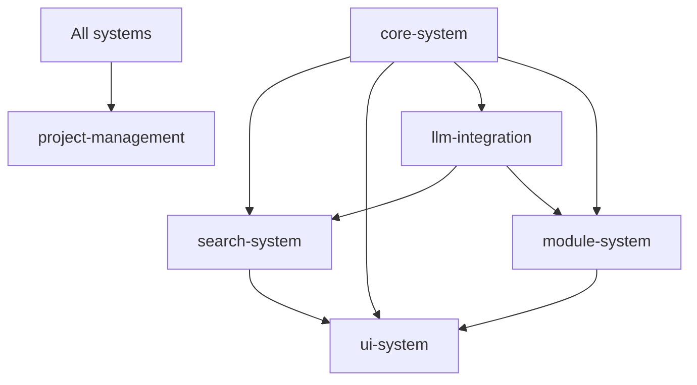

# Current Status

> **Project Management - Architecture and Cross-Cutting Decisions**

Last Updated: 2025-11-15

---

## Overview

Meta-level project governance:
- **Architecture:** System design and module structure
- **Roadmap:** Phase planning and future direction
- **Decisions:** Cross-cutting architectural decisions
- **Principles:** Design philosophy and best practices

**Status:** ✅ Phase 1-7 COMPLETE, Future planning ongoing

---

## Phase Summary

- ✅ **Phase 1:** Complete (8 commands + Skill + PowerShell)
- ✅ **Phase 2:** Complete (Advanced search + msort + module management)
- ✅ **Phase 3:** Complete (Vector search + semantic embeddings)
- ✅ **Phase 4:** Complete (LLM integration + Ollama + msummary)
- ✅ **Phase 5:** Complete (Search improvements + performance optimization + archive automation)
- ✅ **Phase 6:** Complete (Hierarchical modules + wiki connections + AI suggestions + graph versioning)
- ✅ **Phase 7:** Complete (Enhanced TUI with multi-mode browser)

---

## Current Work (2025-11-15)

### Completed Today

- [x] **Module restructuring migration** ⭐⭐⭐
  - [x] Split memory-system into 6 feature-based modules
  - [x] Created new module structure:
    - [[projects/memory-tool/core-system]] - Timeline, init, basic CLI
    - [[projects/memory-tool/search-system]] - Text, vector, hybrid search
    - [[projects/memory-tool/module-system]] - Hierarchical modules, wiki links, graph
    - [[projects/memory-tool/ui-system]] - CLI, TUI, aliases
    - [[projects/memory-tool/llm-integration]] - LLM features, embeddings
    - [[projects/memory-tool/project-management]] - Architecture, roadmap (this module)
  - [x] Migrated current.md content to appropriate modules
  - [x] Ready for PLAN document migration

### Previous Completed Work

- [x] **Enhanced TUI Browser (Phase 7)** ⭐⭐⭐⭐⭐
- [x] **Hierarchical Modules + Wiki Connections (Phase 6)** ⭐⭐⭐⭐⭐
- [x] **Search Improvements Phase 1, 2, 3** ⭐⭐⭐⭐
- [x] **Performance Optimization (Vector search)** ⭐⭐⭐
- [x] **Archive automation (marchive)** ⭐⭐⭐
- [x] **MCP Server evaluation and deprioritization** ✅

### In Progress

- [ ] PLAN document migration to new modules

### Next Up

**Future Phases (Not prioritized yet):**
1. ⏳ Testing Coverage (pytest, stability)
2. ⏳ Additional Usability Improvements
3. ⏳ MCP Server (deferred until real-world validation)

---

## Key Architectural Decisions

See `decisions.md` in this module for details.

**Decision #24 (2025-11-14):**
- **MCP Server Deprioritization**
- Rationale: Focus on practical improvements, avoid premature optimization
- Impact: MCP moved to lowest priority, Phase 5 redefined
- Philosophy: Stability > Features, Practicality > Completeness

**Decision #29 (2025-11-15):**
- **Archive Automation Improvements**
- Three modes: --up-to N, --keep-recent N, --phase
- User feedback: "Phase는 잘 사용하지 않음"
- Default: --keep-recent 10 (configurable)

**Decision #30 (2025-11-15):**
- **Module Restructuring**
- Split memory-system into 6 feature-based modules
- Rationale: Improved cohesion, separation of concerns
- Benefits: Easier navigation, independent evolution

---

## System Architecture

### Module Structure

```
projects/memory-tool/
├── core-system/         # Timeline, init, basic data (Phase 1)
├── search-system/       # Text, vector, hybrid search (Phases 2, 3, 5)
├── module-system/       # Hierarchical modules, wiki links (Phase 6)
├── ui-system/           # CLI, TUI, aliases (Phases 1, 7)
├── llm-integration/     # LLM features, embeddings (Phase 4)
└── project-management/  # Architecture, roadmap (this module)
```

### Dependency Graph



**Key Principles:**
- Core system is foundational (no dependencies)
- LLM integration provides services to search and modules
- UI system is presentation layer (depends on all)
- Project management is meta-level (cross-cutting)

---

## Design Philosophy

**From `.claude/guidelines.md`:**
1. **정직한 사고 (Honest thinking)** - Acknowledge limitations
2. **심층 사고 (Deep thinking)** - Explore root causes
3. **비판적 검증 (Critical verification)** - Question assumptions
4. **제3의 길 탐색 (Third way exploration)** - Seek alternatives
5. **악마의 옹호자 (Devil's advocate)** - Challenge the plan

**Applied to memory_tool:**
- Capture first, organize later (honest about organization difficulty)
- Deep analysis of search needs (multiple backends)
- Critical evaluation of MCP Server value (deprioritized)
- Third way: Hierarchical modules + wiki links (hybrid approach)
- Devil's advocate: Question each phase's necessity

---

## Development Workflow

**Standard workflow (from CLAUDE.md):**
1. Commit & Push (save state)
2. Branch (feature/xxx)
3. Plan (document or discussion)
4. Get Approval (user confirmation)
5. Record Start (m "Starting...")
6. Implement (with TodoWrite tracking)
7. Test (verify functionality)
8. Complete (ensure all works)
9. Record End (m "Completed...")
10. Merge (commit, push, merge to main)

**Dogfooding:**
- Use `m` for timeline entries
- Use `ms` for searching past work
- Use `mcontext` for session context
- Use `mmodule` for module management

---

## Metrics

**Commands:** 12 operational
- m, minit, ms, mcontext, malias, marchive, msummary, mtoday, mweek, mstatus, mmodule, mhooks

**Module Actions:** 14 actions
- create, list, tree, archive, unarchive, connections, graph, rebuild-graph, check-links, suggest-links, suggest-ai, auto-tag, graph-snapshot, graph-history, graph-diff

**Features:**
- Timeline capture ✅
- Search (text + vector + SQLite FTS5) ✅
- Advanced search (BM25, filters, hybrid, caching) ✅
- Performance optimization (batch embeddings, incremental indexing) ✅
- Claude Skill integration ✅
- LLM summarization (Anthropic + Ollama) ✅
- Hierarchical module system ✅
- Wiki-style connections ([[links]]) ✅
- Graph visualization (Mermaid/Graphviz) ✅
- AI-based connection suggestions ✅
- Graph version management ✅
- Git hooks integration ✅
- Archive automation (3 modes) ✅
- Index optimization (FTS5 optimize, vacuum) ✅
- Enhanced TUI browser (4 modes) ✅

**Documentation:**
- 6 module-specific current.md files
- decisions.md in each module (domain-specific)
- Architecture decisions (this module)
- Module organization principles docs

---

## Future Roadmap

### Potential Future Phases

**Phase 8: Testing & Quality (Not scheduled)**
- Pytest test suite
- Integration tests
- CI/CD pipeline
- Code coverage targets

**Phase 9: Performance at Scale (Not scheduled)**
- Large corpus optimization (>10GB)
- Distributed search (multiple projects)
- Advanced caching strategies

**Phase 10: Advanced Features (Not scheduled)**
- MCP Server (if validated by real-world use)
- Web UI (browser-based interface)
- Mobile companion app
- Team/collaboration features

**Philosophy:**
- "Capture first, optimize later"
- "Use it before you improve it"
- "Stability > Features"
- "Real-world validation > Speculation"

---

## Dependencies

**Depends on:**
- All 5 other modules (meta-level overview)

**Depended on by:**
- None (governance, not implementation)

---

## Known Issues

None - This is a documentation/governance module.

---

## Notes

**Module Restructuring Benefits:**
- ✅ Clearer separation of concerns
- ✅ Easier to find specific information
- ✅ Reduced cognitive load per module
- ✅ Better visualization in graph view
- ✅ Independent evolution of subsystems

**Project Status:**
- Phases 1-7: Production-ready
- Real-world usage: Ongoing (dogfooding)
- Next steps: Determined by user feedback and actual needs

**Success Criteria:**
- ✅ 0.5-second timeline capture
- ✅ Fast search (<1s for most queries)
- ✅ Semantic search available
- ✅ Module organization clear
- ✅ Claude Code integration working
- ✅ Documentation comprehensive

**Philosophy in Practice:**
- Started simple (Phase 1: core commands)
- Added search (Phases 2-3: multiple backends)
- Enhanced with AI (Phase 4: LLM integration)
- Optimized based on use (Phase 5: performance)
- Structured knowledge (Phase 6: hierarchical modules)
- Improved UX (Phase 7: enhanced TUI)
- Now: Stabilize and validate

**Next Major Decision:**
- Wait for real-world feedback
- Identify pain points from actual use
- Prioritize based on impact, not speculation

---

**See Also:**
- `.claude/guidelines.md` - Thinking principles
- `.claude/memory-context.md` - Current session context (auto-generated)
- `CLAUDE.md` - Project instructions for Claude Code
- `.memory/docs/MODULE-ORGANIZATION-PRINCIPLES.md` - Module guidelines
