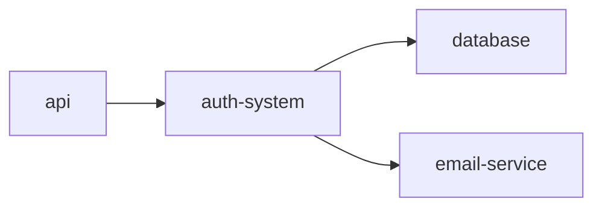

# User Guide

> Complete guide to memory_tool - Time-Space Integrated Knowledge System

**Version:** 1.0.0-alpha
**Last Updated:** 2026-01-16

---

## Table of Contents

### [Part 1: Core Concepts](#part-1-core-concepts)
- [What is memory_tool?](#what-is-memory_tool)
- [Timeline System (시간축)](#timeline-system-시간축)
- [Module System (공간축)](#module-system-공간축)
- [Claude Code Integration](#claude-code-integration)
- [Design Philosophy](#design-philosophy)

### [Part 2: Command Reference](#part-2-command-reference)
- [Recording Commands](#recording-commands)
- [Search Commands](#search-commands)
- [Module Commands](#module-commands)
- [LLM Commands](#llm-commands)
- [UI Commands](#ui-commands)
- [Utility Commands](#utility-commands)

### [Part 3: Real-world Workflows](#part-3-real-world-workflows)
- [Daily Work Flow](#daily-work-flow)
- [Project Management](#project-management)
- [Research & Learning](#research--learning)
- [Working with Claude Code](#working-with-claude-code)

### [Part 4: Advanced Features](#part-4-advanced-features)
- [Vector Search & Semantic Search](#vector-search--semantic-search)
- [LLM Integration](#llm-integration)
- [Wiki-style Connections](#wiki-style-connections)
- [Module Organization](#module-organization)
- [Performance Optimization](#performance-optimization)

### [Part 5: Configuration](#part-5-configuration)
- [Base Folder](#base-folder)
- [config.yaml Reference](#configyaml-reference)
- [Environment Variables](#environment-variables)
- [Best Practices](#best-practices)

### [Part 6: Notion Integration](#notion-integration)
- [Setup](#setup)
- [Commands](#commands)
- [nwatch Modes](#nwatch-modes)
- [Conflict Resolution](#conflict-resolution)

---

# Part 1: Core Concepts

## What is memory_tool?

memory_tool is a **Time-Space Integrated Knowledge System** designed to capture, organize, and retrieve knowledge with minimal friction.

### The Problem

Traditional knowledge management tools force you to:
- **Organize while working** - Breaking your flow
- **Choose structure upfront** - Before understanding the problem
- **Maintain manually** - Constant gardening overhead
- **Context switch** - Between working and documenting

### The Solution

memory_tool separates capture from organization:

```
TIME (Timeline)         SPACE (Modules)         CONNECTIONS (Links)
     ↓                       ↓                         ↓
Capture in 0.5s      Organize on weekends      Emerge naturally
     ↓                       ↓                         ↓
Never lose context   Clear structure        Discover relationships
```

### Core Philosophy

> **"0.5초로 포착하고, 주말에 정리하며, 평생 활용한다."**

**5 Core Principles:**

1. **Time First** - Capture first, organize later
   - Work happens in time order
   - Record as you go
   - Organize when you have perspective

2. **Lossless** - Record everything, lose nothing
   - Too much data is better than too little
   - You can always filter later
   - Can't recover what you didn't capture

3. **Minimal Friction** - 0.5 second capture principle
   - If recording takes > 0.5 seconds, you won't do it
   - One command: `m "message"`
   - No forms, no prompts, no decisions

4. **Loose Coupling** - Modular architecture
   - Each project has its own `.memory/`
   - Can connect projects with links
   - No global state to corrupt

5. **Local First** - Local by default, explicit expansion
   - Your data stays on your machine
   - No cloud required (optional)
   - Full control and privacy

---

## Timeline System (시간축)

The **Timeline** is your time-based capture system. Think of it as your "external brain's working memory".

### Concept

```
Work happens in TIME:
├── 09:00 - Started project
├── 10:30 - Made decision A
├── 14:15 - Fixed bug B
└── 16:45 - Completed feature C

Your brain remembers: "I fixed that bug yesterday afternoon"
```

### Structure

```
.memory/timeline/
├── daily/                    # NEW: Daily timeline (recommended)
│   ├── 2025-11/
│   │   ├── 13.md            # November 13
│   │   ├── 14.md            # November 14
│   │   └── 15.md            # November 15
│   └── 2025-12/
│       └── 01.md
├── 2025-11/                  # LEGACY: Old structure (still supported)
│   └── *.md
└── (reviews/, plans/ - see below)
```

**Note:** New installations use `timeline/daily/`. Existing projects can migrate with `migrate-timeline` command.

**Format:**
```markdown
# 2025-11-15 Timeline
- 09:00 | Started working on authentication
- 10:30 | Decision: Using JWT tokens instead of sessions
- 14:15 | Fixed: Password reset email not sending
- 16:45 | Completed: User registration flow with email verification
```

### Why Timeline?

**Natural for working:**
- ✅ Matches how you actually work (chronological)
- ✅ No decisions needed (just record)
- ✅ Captures context automatically (time = context)
- ✅ Easy to review ("What did I do yesterday?")

**Natural for memory:**
- ✅ Your brain thinks in time
- ✅ "I fixed that bug last Tuesday afternoon"
- ✅ Not "I fixed that bug in file X line Y"

---

## Module System (공간축)

The **Module System** is your topic-based organization system. Think of it as your "external brain's long-term memory".

### Concept

```
Knowledge organizes by TOPIC:
└── projects/
    └── auth-system/
        ├── current.md        # Current state
        ├── decisions.md      # Key decisions
        ├── dependencies.md   # What it depends on
        └── interface.md      # How to use it

Your brain thinks: "What did I decide about authentication?"
```

### Structure

```
.memory/modules/
├── auth-system/           # Flat module
│   ├── module.md
│   ├── current.md
│   └── decisions.md
│
├── projects/              # Hierarchical modules
│   ├── todo-app/
│   │   ├── frontend/
│   │   ├── backend/
│   │   └── deployment/
│   └── blog/
│
└── concepts/              # Conceptual knowledge
    ├── jwt-tokens/
    └── oauth2-flow/
```

### Module Files

**module.md** - Definition
```markdown
# Auth System

**Purpose:** User authentication and authorization

**Scope:**
- User login/logout
- JWT token management
- Password reset
- Email verification

**Out of scope:**
- User profile management
- Social login
```

**current.md** - Current state
```markdown
# Current Status

**Phase:** Implementation
**Progress:** 75%

## Completed
- ✅ User registration
- ✅ Email verification
- ✅ JWT token generation

## In Progress
- 🔄 Password reset flow

## Pending
- ⏳ Remember me functionality
- ⏳ Two-factor authentication
```

**decisions.md** - Key decisions
```markdown
# Key Decisions

## Decision #1: JWT vs Sessions

**Date:** 2025-11-10
**Decision:** Using JWT tokens instead of sessions
**Rationale:**
- Stateless (no server-side storage)
- Scalable (no session store)
- Mobile-friendly (REST API)

**Trade-offs:**
- Can't invalidate tokens before expiry
- Larger payload in requests
- **Mitigation:** Short expiry (15min) + refresh tokens
```

### Why Modules?

**Natural for organizing:**
- ✅ Group related knowledge by topic
- ✅ Clear boundaries and scope
- ✅ Easy to find ("Where is auth info?")
- ✅ Hierarchical when needed

**Natural for reuse:**
- ✅ Can reference in other projects
- ✅ Can share patterns
- ✅ Can track evolution

---

## Claude Code Integration

memory_tool's **killer feature** is automatic context generation for Claude Code.

### The Problem

Every time you start a Claude Code session:
- ❌ You explain what you're working on
- ❌ You describe recent changes
- ❌ You provide context manually
- ❌ Claude starts from zero knowledge

### The Solution

```bash
# One command
mcontext
```

**Result:** `.claude/memory-context.md` contains:
- 📅 Recent timeline entries (last 3 days)
- 📦 Active modules (current work)
- 🎯 Key decisions (important choices)
- 🔗 Connections (related knowledge)

**Claude Code automatically reads this file!** 🤖

### Example Context

```markdown
# Memory Context

**Generated:** 2025-11-15 17:00

## Recent Timeline (Last 3 Days)

### 2025-11-15
- 09:00 | Started implementing password reset
- 10:30 | Decision: Using email tokens with 1-hour expiry
- 14:15 | Fixed: Email template not rendering variables
- 16:45 | Completed: Password reset flow with tests

### 2025-11-14
- 10:00 | Implemented JWT refresh token rotation
- 15:30 | Added rate limiting to auth endpoints

## Active Modules

### auth-system
**Status:** In Progress (75%)
**Recent:** Password reset flow completed
**Key Decisions:**
- Using JWT tokens (stateless)
- Email tokens for password reset (1h expiry)
- Rate limiting on auth endpoints (10 req/min)

## Key Concepts
- JWT authentication with refresh tokens
- Email-based password reset
- Rate limiting for security
```

### Workflow

```bash
# Morning: Start work
cd my-project

# During day: Capture everything
m "Started feature X"
m "Decision: Approach Y"
m "Fixed bug Z"

# Before Claude session: Generate context
mcontext

# Open Claude Code
# → Claude automatically knows your context! 🎉
```

### Auto-update

```yaml
# .memory/config.yaml
context:
  auto_update: true  # Regenerate after each 'm' command
```

With auto-update, you never have to run `mcontext` manually!

---

## Design Philosophy

### Time First, Not Structure First

**Traditional approach:**
```
1. Design folder structure
2. Create documents
3. Categorize as you go
4. Maintain organization
```
❌ Problem: You don't know the structure until you understand the problem

**memory_tool approach:**
```
1. Record as you work (timeline)
2. Patterns emerge naturally
3. Create modules when clear
4. Refactor as understanding grows
```
✅ Solution: Structure emerges from usage

### Capture vs Organization

**Capture (Fast):**
- Do while working
- No thinking required
- Timeline-based
- Command: `m "message"`
- Time: 0.5 seconds

**Organization (Slow):**
- Do during reviews
- Thoughtful process
- Module-based
- Commands: `module create`, edit files
- Time: Weekend sessions

**Analogy:**
- Capture = Camera shutter (instant)
- Organization = Photo album (deliberate)

### Lossless Philosophy

**Why record everything?**

1. **You forget context**
   ```
   // 3 months later
   "Why did I choose PostgreSQL instead of MySQL?"

   // With memory_tool
   ms "PostgreSQL MySQL"
   → "Decision #5: PostgreSQL for JSONB support"
   ```

2. **Future you is a different person**
   - Different context
   - Different priorities
   - Needs reminders

3. **Patterns emerge from data**
   - Can't find patterns in unrecorded data
   - More data = more insights

4. **Storage is cheap, time isn't**
   - 1 year of timeline = ~1MB
   - Recreating context = hours/days

### Local First

**Why local?**

1. **Speed** - No network latency
2. **Privacy** - Your data, your machine
3. **Reliability** - Works offline
4. **Control** - You own the files
5. **Simplicity** - No servers, no auth, no billing

**Can sync:** Git, Dropbox, etc. (your choice)

---

# Part 2: Command Reference

## Recording Commands

### `m` - Record to Timeline

**Purpose:** Capture thoughts, actions, decisions in 0.5 seconds

**Basic Usage:**
```bash
m "message"
```

**Examples:**
```bash
# Simple record
m "Started working on authentication"

# Decision
m "Decision: Using JWT tokens instead of sessions"

# Bug fix
m "Fixed: Password reset email not sending - was using wrong SMTP port"

# Learning
m "Learned: PostgreSQL JSONB is faster than JSON for queries"

# Task completion
m "Completed: User registration flow with email verification"
```

**Advanced Usage:**
```bash
# Specific time (today)
m --time "14:30" "Had meeting with design team"

# Specific date and time
m --date "2025-11-14" --time "16:00" "Deployed to production"

# Yesterday
m --yesterday "Late night coding session"

# Force (bypass 1-year warning)
m --date "2024-01-01" --force "Retroactive documentation"
```

**Validation:**
- ❌ Future time → Hard error (blocked)
- ⚠️ >1 year past → Warning (need `--force`)
- ✅ Within 1 year → Accepted

**Tips:**
1. **Be specific:** "Fixed bug X" better than "Fixed bug"
2. **Include context:** "in file.py line 42"
3. **Use prefixes:** "Decision:", "Bug:", "Learning:", "Completed:"
4. **Natural language:** Write how you think
5. **Don't overthink:** Better to record than not

**Output:**
```
OK Recorded at 2025-11-15 17:45
-> .memory\timeline\2025-11\15.md
```

**Aliases:**
```bash
m         # Python environment
malias    # After alias installation
```

---

### `minit` - Initialize Project

**Purpose:** Set up `.memory/` structure in current directory

**Usage:**
```bash
minit
```

**What it creates:**
```
.memory/
├── timeline/          # Timeline entries
│   └── YYYY-MM/
│       └── DD.md
├── modules/           # Module organization
├── concepts/          # Conceptual knowledge
├── config.yaml        # Configuration
└── .connections.db    # Graph database (auto-created)
```

**First time only:**
- Creates default config
- Sets up directory structure
- Initializes databases

**Safe to run multiple times:**
- Won't overwrite existing data
- Will create missing directories
- Will update config if needed

**Example:**
```bash
cd /my-project
minit

# Output:
# ✓ Created .memory/timeline
# ✓ Created .memory/modules
# ✓ Created .memory/concepts
# ✓ Created .memory/config.yaml
#
# Memory system initialized!
#
# Next steps:
#   m "First entry"
#   ms "search"
#   mcontext
```

---

### `msort` - Sort Timeline

**Purpose:** Reorder timeline entries by timestamp

**Usage:**
```bash
msort <target> [options]
```

**Targets:**
- `today` - Sort today's timeline
- `YYYY-MM-DD` - Sort specific date (e.g., `2025-11-14`)
- `all` - Sort all timeline files

**Options:**
- `--no-backup` - Skip creating backup files (.bak)

**Why needed:**
- Manual edits may break time order
- Batch imports from other systems
- Time-travelling records (--yesterday, --date)

**Examples:**
```bash
# Sort today's timeline
msort today

# Sort specific date
msort 2025-11-14

# Sort all timelines
msort all

# Sort without backup
msort today --no-backup
```

**Before:**
```markdown
- 14:00 | Task A
- 10:00 | Task B
- 12:00 | Task C
```

**After:**
```markdown
- 10:00 | Task B
- 12:00 | Task C
- 14:00 | Task A
```

**Note:** Original files are automatically backed up with `.bak` extension unless `--no-backup` is used.

---

### `mreview` - Review System

**Purpose:** Create and manage weekly/monthly reviews for reflection and retrospective

**Usage:**
```bash
mreview <type> [action] [identifier]
```

**Types:**
- `weekly` - Weekly review (ISO week format: W47)
- `monthly` - Monthly review (month number: 11)

**Actions:**
- (none) - Create/edit review (opens editor)
- `show` - Display review content

**Examples:**

#### Weekly Review
```bash
# Create/edit this week's review (opens editor)
mreview weekly

# View this week's review
mreview weekly show

# View specific week
mreview weekly show W47

# Create without opening editor
mreview weekly --no-editor
```

#### Monthly Review
```bash
# Create/edit this month's review
mreview monthly

# View this month's review
mreview monthly show

# View specific month
mreview monthly show 11
```

**Generated Structure:**
```
.memory/reviews/
├── weekly/
│   └── 2025/
│       ├── W46.md
│       └── W47.md
├── monthly/
│   └── 2025/
│       ├── 10.md
│       └── 11.md
└── templates/
    ├── weekly.md
    └── monthly.md
```

**Automatic Features:**
- **Auto-links:** Daily Timeline links automatically generated
- **Auto-statistics:** Entry counts, active days calculated
- **Auto-template:** Structured review template applied
- **Variable substitution:** Dates, weeks, months, stats auto-filled
- **Editor integration:** Opens your preferred editor (EDITOR env var)
- **Legacy compatible:** Works with both old and new Timeline structures

**Weekly Review Template:**
```markdown
# Week W47 Review (2025-11-18 ~ 2025-11-24)

## Daily Timeline Links
- [Mon 2025-11-18](../timeline/daily/2025-11/18.md) (5 entries)
- [Tue 2025-11-19](../timeline/daily/2025-11/19.md) (3 entries)
...

## Summary
Total entries: 25 | Active days: 5/7

## Accomplishments
-

## Challenges
-

## Learnings
-

## Next Week Goals
-
```

**Editor Configuration:**
- Windows: `notepad` (default)
- Linux/Mac: `vi` (default)
- Custom: Set `EDITOR` environment variable

**Relationship with Timeline and Plan:**
```
Timeline (facts) → Review (reflection) → Plan (action)
     ↓                    ↓                   ↓
  What happened      What it means      What to do next
```

---

### `migrate-timeline` - Timeline Migration

**Purpose:** Migrate timeline files from legacy structure to new daily/ structure

**Usage:**
```bash
python -m memory_tool migrate-timeline [options]
```

**Options:**
- `--dry-run` - Preview changes without moving files

**When to use:**
- After updating to a version with new Timeline structure
- When transitioning from `timeline/YYYY-MM/DD.md` to `timeline/daily/YYYY-MM/DD.md`
- New users don't need this (auto-uses new structure)

**Examples:**
```bash
# Preview migration (recommended first)
python -m memory_tool migrate-timeline --dry-run

# Execute migration
python -m memory_tool migrate-timeline
```

**What happens:**
1. Scans `.memory/timeline/` for legacy files (outside `daily/`)
2. Moves files to `.memory/timeline/daily/YYYY-MM/DD.md`
3. Cleans up empty legacy directories
4. Preserves all data (no content changes)

**Output:**
```
Migrating timeline files...

Found 45 files to migrate:
  timeline/2025-11/13.md → timeline/daily/2025-11/13.md
  timeline/2025-11/14.md → timeline/daily/2025-11/14.md
  ...

OK Migrated 45 files
Cleaned up 2 empty directories
```

**Safety:**
- `--dry-run` shows what would happen without making changes
- No data loss (only moves, no deletions)
- Backwards compatible (old paths still readable)

---

## Search Commands

### `ms` - Search Timeline and Modules

**Purpose:** Find information across timeline and modules

**Basic Usage:**
```bash
ms "query"
```

**Search Modes:**

#### 1. Text Search (Default)
```bash
ms "authentication"
```

**Features:**
- BM25 ranking (relevance scoring)
- Case-sensitive by default
- Regex support
- Context display

**Options:**
```bash
ms -i "query"              # Case-insensitive
ms "regex.*pattern"        # Regex
ms --head-limit 10 "query" # Limit results
```

#### 2. Semantic Search (Requires [vector])
```bash
ms --semantic "user login process"
```

**Features:**
- Understands meaning, not just keywords
- Finds conceptually similar content
- Better for questions and concepts

**Examples:**
```bash
# Find by concept
ms --semantic "how to authenticate users"

# Find similar decisions
ms --semantic "choosing database technology"
```

#### 3. Hybrid Search (Best of both)
```bash
ms --hybrid "authentication"
```

**Features:**
- Combines text + semantic
- Configurable weights
- Best accuracy

**Options:**
```bash
ms --hybrid "query" --text-weight 0.7 --semantic-weight 0.3
```

**Advanced Filters:**
```bash
# Date filters
ms "query" --after "2025-11-01"
ms "query" --before "2025-11-15"
ms "query" --after "2025-11-01" --before "2025-11-15"

# Type filters
ms "query" --timeline-only     # Only timeline
ms "query" --modules-only      # Only modules
ms "query" --decisions-only    # Only decisions.md

# Exclude patterns
ms "query" --exclude "test"
ms "query" --exclude "deprecated"

# Output control
ms "query" --output-mode content    # Show matched lines
ms "query" --output-mode files      # Show only file paths
ms "query" --output-mode count      # Show match counts
```

**Output Format:**
```
.memory\timeline\2025-11\15.md:12
2025-11-15 00:00
  - 14:30 | Decision: Using JWT tokens for authentication

.memory\modules\auth-system\decisions.md:5
## Decision #1: JWT vs Sessions
**Decision:** Using JWT tokens instead of sessions

Found 2 result(s) in 0.05s
```

**Performance:**
```bash
# Disable cache (testing)
ms "query" --no-cache

# Custom cache TTL
ms "query" --cache-ttl 7200  # 2 hours
```

---

### `mtoday` - View Today's Timeline

**Purpose:** Quick view of today's entries

**Usage:**
```bash
mtoday
```

**Output:**
```
=== Today's Timeline ===
2025-11-15

- 09:00 | Started working on authentication
- 10:30 | Decision: Using JWT tokens instead of sessions
- 14:15 | Fixed: Password reset email not sending
- 16:45 | Completed: User registration flow with email verification

4 entries
```

**Options:**
```bash
# Reverse order (oldest first)
mtoday --reverse

# Limit entries
mtoday --limit 10
```

---

### `mweek` - View This Week's Timeline

**Purpose:** Review week's work

**Usage:**
```bash
mweek
```

**Output:**
```
=== This Week's Timeline ===
Week of 2025-11-10

Mon 2025-11-10
  - 09:00 | Started project
  - 16:00 | Basic setup complete
  2 entries

Tue 2025-11-11
  - 10:00 | Implemented user model
  - 15:30 | Added database migrations
  2 entries

Wed 2025-11-12
  - 09:30 | Working on authentication
  - 14:00 | JWT implementation done
  2 entries

...

Total: 15 entries across 5 days
```

---

### `mstatus` - Project Statistics

**Purpose:** Overview of project knowledge

**Usage:**
```bash
mstatus
```

**Output:**
```
=== Memory Status ===

Timeline:
  Total entries: 142
  First entry: 2025-11-01
  Last entry: 2025-11-15
  Active days: 12

Modules:
  Total modules: 8
  Active modules: 3
  Archived modules: 1

Search Index:
  Indexed files: 45
  Last indexed: 2025-11-15 17:00
  Index size: 2.4 MB

Connections:
  Total connections: 23
  Connected modules: 6
  Orphaned modules: 2
```

---

## Module Commands

### `module create` - Create Module

**Purpose:** Create new module for organizing knowledge

**Usage:**
```bash
python -m memory_tool module create <name> [--desc "description"]
```

**Examples:**
```bash
# Flat module
python -m memory_tool module create auth-system

# Hierarchical module
python -m memory_tool module create projects/todo-app

# With description
python -m memory_tool module create auth-system --desc "User authentication and authorization"

# With tags
python -m memory_tool module create auth-system --tags security,backend
```

**What it creates:**
```
.memory/modules/auth-system/
├── module.md          # Definition
├── current.md         # Current state
├── decisions.md       # Key decisions
├── dependencies.md    # Dependencies
└── interface.md       # Usage interface
```

**Templates are pre-filled:**
```markdown
# auth-system

**Purpose:** User authentication and authorization

**Status:** Active
**Created:** 2025-11-15

## Scope

Define what this module covers...

## Current State

Document current status...
```

---

### `module list` - List Modules

**Purpose:** View all modules

**Usage:**
```bash
python -m memory_tool module list [--archived]
```

**Output:**
```
Active Modules:
  auth-system           User authentication
  database              Database configuration
  api                   REST API endpoints

3 module(s)
```

**With archived:**
```bash
python -m memory_tool module list --archived

All Modules:
  auth-system           User authentication
  database              Database configuration
  api                   REST API endpoints
  [archived] old-api    Deprecated API (archived 2025-11-10)

4 module(s) (1 archived)
```

---

### `module tree` - View Hierarchy

**Purpose:** Visualize module structure

**Usage:**
```bash
python -m memory_tool module tree
```

**Output:**
```
Module Hierarchy:

└── projects
    ├── todo-app
    │   ├── frontend
    │   ├── backend
    │   └── deployment
    └── blog
        ├── cms
        └── theme
```

---

### `module archive` - Archive Module

**Purpose:** Mark module as complete/inactive

**Usage:**
```bash
python -m memory_tool module archive <name> --reason "reason"
```

**Examples:**
```bash
# Full path
python -m memory_tool module archive projects/memory-tool/core-system --reason "Phase completed"

# Short name (auto-search)
python -m memory_tool module archive core-system --reason "Phase completed"
# → Automatically finds 'projects/memory-tool/core-system'
```

**Module Auto-Search Feature:**

When you provide a short module name, the system automatically searches for matching modules:

```bash
# Instead of typing full path:
python -m memory_tool module archive projects/memory-tool/core-system

# Just use short name:
python -m memory_tool module archive core-system
# Output: Resolved 'core-system' -> 'projects/memory-tool/core-system'
```

**Auto-search behavior:**
- **1 match found:** Automatically uses it, shows resolved path
- **Multiple matches:** Shows list to choose from
- **No match:** Error with suggestion to check `module list`

**What happens:**
- Moved to `.memory/modules/archive/<name>/`
- Marked as archived
- Still searchable
- Can be unarchived

**Note:** Module auto-search also works with `msummary --module`, `marchive --module`, and other commands that accept module names.

---

### `module connections` - View Connections

**Purpose:** See module relationships

**Usage:**
```bash
python -m memory_tool module connections [name]
```

**Example:**
```bash
# All connections
python -m memory_tool module connections

# Specific module
python -m memory_tool module connections auth-system
```

**Output:**
```
auth-system connections:
  → database           (depends on)
  → email-service      (uses)
  ← api                (used by)

3 connection(s)
```

---

### `module graph` - Visualize Graph

**Purpose:** Generate visual graph

**Usage:**
```bash
python -m memory_tool module graph [--format FORMAT] [--output FILE]
```

**Formats:**
- `mermaid` - Mermaid diagram (default)
- `graphviz` - Graphviz DOT format

**Examples:**
```bash
# Mermaid to console
python -m memory_tool module graph

# Save to file
python -m memory_tool module graph --format mermaid --output graph.md

# Graphviz
python -m memory_tool module graph --format graphviz --output graph.dot
```

**Output (Mermaid):**


---

### `module rebuild-graph` - Rebuild Connections

**Purpose:** Scan files and rebuild connection database

**Usage:**
```bash
python -m memory_tool module rebuild-graph
```

**When to use:**
- After manual file edits
- After adding [[wiki links]]
- Graph seems out of sync
- Corruption suspected

**Output:**
```
Rebuilding connection graph...

OK Connection graph rebuilt
Found 151 connections
Connected modules: 24
Orphaned modules: 6

Auto-snapshot created (version 4)
```

---

### `module check-links` - Validate Links

**Purpose:** Find broken [[wiki links]]

**Usage:**
```bash
python -m memory_tool module check-links
```

**Output:**
```
Checking module links...

Found 2 module(s) with broken links:

  auth-system:
    × [[old-api]] -> module not found
    × [[email-v1]] -> module not found

OK No orphaned modules
```

---

### `module suggest-links` - Manual Suggestions

**Purpose:** Get connection suggestions based on text similarity

**Usage:**
```bash
python -m memory_tool module suggest-links [name] [--limit N]
```

**Example:**
```bash
python -m memory_tool module suggest-links auth-system --limit 5
```

**Output:**
```
Suggested connections for auth-system:

1. database (score: 0.85)
   Reason: Frequent co-mentions of "user", "query", "table"

2. email-service (score: 0.72)
   Reason: Both mention "verification", "template"

3. api (score: 0.68)
   Reason: Shared terms: "endpoint", "request", "response"
```

---

### `module suggest-ai` - AI Suggestions

**Purpose:** Get AI-powered connection suggestions (requires [llm])

**Usage:**
```bash
python -m memory_tool module suggest-ai [name] [--limit N]
```

**Example:**
```bash
python -m memory_tool module suggest-ai auth-system --limit 3
```

**Output:**
```
AI-suggested connections for auth-system:

1. database (confidence: high)
   Rationale: Authentication requires persistent storage of user credentials
   and session data. The auth-system depends on database for user lookups.

2. rate-limiter (confidence: medium)
   Rationale: Authentication endpoints are common attack vectors. Consider
   connecting to rate-limiter to prevent brute-force attacks.

3. logging (confidence: medium)
   Rationale: Security events like failed login attempts should be logged
   for audit trails and intrusion detection.
```

---

### `module auto-tag` - Auto Tagging

**Purpose:** Generate tags using AI (requires [llm])

**Usage:**
```bash
python -m memory_tool module auto-tag [name]
```

**Example:**
```bash
python -m memory_tool module auto-tag auth-system
```

**Output:**
```
Generated tags for auth-system:
  - security
  - backend
  - authentication
  - jwt
  - api

Tags added to module.md
```

---

### `module graph-history` - Version History

**Purpose:** View graph evolution over time

**Usage:**
```bash
python -m memory_tool module graph-history [--limit N]
```

**Output:**
```
Graph Version History:

Version 4 - 2025-11-15 17:00
  Nodes: 24 | Edges: 151
  Note: After module split

Version 3 - 2025-11-15 10:00
  Nodes: 18 | Edges: 89
  Note: Added AI suggestions

Version 2 - 2025-11-14 16:00
  Nodes: 15 | Edges: 67
  Note: (auto-snapshot)

Version 1 - 2025-11-14 08:00
  Nodes: 12 | Edges: 45
  Note: Initial snapshot
```

---

### `module graph-diff` - Compare Versions

**Purpose:** See what changed between versions

**Usage:**
```bash
python -m memory_tool module graph-diff --v1 3 --v2 4
```

**Output:**
```
Graph Changes: v3 → v4

Added Nodes (6):
  + core-system
  + search-system
  + module-system
  + ui-system
  + llm-integration
  + project-management

Removed Nodes (1):
  - memory-system

Added Edges (62):
  + core-system → search-system
  + core-system → ui-system
  ...

Removed Edges (0):
  (none)

Summary:
  Nodes: 18 → 24 (+6, -1)
  Edges: 89 → 151 (+62, -0)
```

---

### `module graph-snapshot` - Create Snapshot

**Purpose:** Save current graph state

**Usage:**
```bash
python -m memory_tool module graph-snapshot [--notes "notes"]
```

**Example:**
```bash
python -m memory_tool module graph-snapshot --notes "Before refactoring"
```

**Output:**
```
Snapshot created (version 5)
Nodes: 24 | Edges: 151
Note: Before refactoring
```

---

## LLM Commands

### `msummary` - Summarize with AI

**Purpose:** Generate AI summaries of timeline or modules (requires [llm])

**Usage:**
```bash
msummary [timeline|module] [name] [options]
```

**Examples:**

#### Summarize Timeline
```bash
# Today
msummary timeline

# Specific date
msummary timeline --date 2025-11-14

# Date range
msummary timeline --from 2025-11-01 --to 2025-11-15

# This week
msummary timeline --week
```

**Output:**
```
=== Timeline Summary ===
Period: 2025-11-15

Key Activities:
• Implemented password reset flow with email verification
• Made decision to use JWT tokens with 15-minute expiry
• Fixed bug in email template rendering
• Added rate limiting to authentication endpoints

Decisions Made:
• JWT tokens chosen over sessions for stateless architecture
• Email verification with 1-hour token expiry
• Rate limiting set to 10 requests per minute

Progress:
• Authentication system: 75% complete
• Password reset: 100% complete
• Two-factor auth: Not started

Blockers:
• None reported

Next Steps:
• Implement remember-me functionality
• Add two-factor authentication
• Security audit
```

#### Summarize Module
```bash
# Specific module
msummary module auth-system

# All modules
msummary module --all
```

**Output:**
```
=== Module Summary: auth-system ===

Overview:
Authentication and authorization system handling user login, registration,
and password management using JWT tokens.

Current State:
• Status: In Progress (75%)
• Active development on password reset
• Core authentication complete and tested

Key Decisions:
• #1: JWT tokens instead of sessions (2025-11-10)
  - Stateless architecture for scalability
  - 15-minute access token, 7-day refresh token
• #2: Email-based password reset (2025-11-12)
  - One-time tokens with 1-hour expiry
  - Rate limited to prevent abuse

Dependencies:
• database - User credential storage
• email-service - Verification emails
• rate-limiter - Brute force protection

Recent Activity:
• 2025-11-15: Completed password reset flow
• 2025-11-14: Added JWT refresh token rotation
• 2025-11-13: Implemented email verification

Next Milestones:
• Remember-me functionality
• Two-factor authentication
• Security audit and penetration testing
```

---

## UI Commands

### `mbrowse` - Interactive TUI Browser

**Purpose:** Explore your knowledge with visual interface (requires [tui])

**Usage:**
```bash
mbrowse [--mode MODE]
```

**Modes:**
- `search` - Search interface (default)
- `timeline` - Timeline browser
- `modules` - Module explorer
- `graph` - Graph visualizer

**Examples:**
```bash
# Start in search mode
mbrowse

# Start in timeline mode
mbrowse --mode timeline

# Start in graph mode
mbrowse --mode graph
```

**Features:**

#### Search Mode
- Tab-based interface
- Filter toggles (timeline/modules/decisions)
- Live search results
- Vim-style navigation (j/k/h/l)
- File preview (Enter)

**Keys:**
- `Tab` - Switch modes
- `/` - Focus search
- `j/k` - Navigate results
- `Enter` - Open file
- `q` - Quit

#### Timeline Mode
- Date-based navigation
- Entry list by day
- Statistics panel
- `n/p` - Next/Previous day

#### Modules Mode
- Hierarchical tree view
- Module details panel
- Connection display
- `Enter` - Expand/collapse
- `Space` - View details

#### Graph Mode
- Visual graph display
- Connection lines
- Node selection
- Sort by connections/name
- Graph statistics

---

### `malias` - Manage Aliases

**Purpose:** Install/uninstall command aliases

**Usage:**
```bash
malias <action> [commands] [options]
```

**Actions:**
- `install` - Install aliases
- `uninstall` - Remove aliases
- `list` - Show alias status

**Examples:**

#### Install All (Batch Files)
```bash
malias install
```

**Creates:**
- `%USERPROFILE%\.memory\bin\m.bat`
- `%USERPROFILE%\.memory\bin\ms.bat`
- `%USERPROFILE%\.memory\bin\mtoday.bat`
- etc.

#### Install Specific
```bash
malias install m ms mtoday
```

#### PowerShell Profile (Recommended)
```bash
malias install --powershell
```

**Adds to:** `$PROFILE` (PowerShell profile)

**Functions:**
```powershell
function m { python -m memory_tool record $args }
function ms { python -m memory_tool search $args }
# etc.
```

#### Unix Shell
```bash
malias install --shell bash  # or zsh

# Then add to profile:
echo 'source ~/.memory/aliases.sh' >> ~/.bashrc
```

#### List Status
```bash
malias list
```

**Output:**
```
Alias Status:

Batch Files:
  ✓ m           -> %USERPROFILE%\.memory\bin\m.bat
  ✓ ms          -> %USERPROFILE%\.memory\bin\ms.bat
  ✓ mtoday      -> %USERPROFILE%\.memory\bin\mtoday.bat
  ...

PowerShell:
  ✓ m           -> function in $PROFILE
  ✓ ms          -> function in $PROFILE
  ...

10 alias(es) installed
```

#### Uninstall
```bash
malias uninstall
```

---

### `mcompletion` - Shell Completion

**Purpose:** Install shell auto-completion (requires [completion])

**Usage:**
```bash
mcompletion <action> <shell>
```

**Shells:**
- `bash`
- `zsh`
- `fish`

**Examples:**

#### Install Bash Completion
```bash
# Install
mcompletion install bash

# Add to .bashrc
echo 'eval "$(register-python-argcomplete memory_tool)"' >> ~/.bashrc

# Reload
source ~/.bashrc
```

#### Install Zsh Completion
```bash
# Install
mcompletion install zsh

# Add to .zshrc
echo 'eval "$(register-python-argcomplete memory_tool)"' >> ~/.zshrc

# Reload
source ~/.zshrc
```

**Result:**
```bash
# Type and press Tab
ms <Tab>
# Shows: --semantic --hybrid --after --before ...

module <Tab>
# Shows: create list tree archive connections graph ...
```

---

### `mtutorial` - Interactive Tutorial

**Purpose:** Learn memory_tool interactively

**Usage:**
```bash
mtutorial
```

**Content:**
- Step-by-step lessons
- Interactive exercises
- Best practices
- Common patterns
- ~15 minutes

**Topics:**
1. Basic recording (m command)
2. Searching (ms command)
3. Module creation
4. Claude Code integration
5. Advanced features

---

## Utility Commands

### `mindex` - Manage Search Index

**Purpose:** Maintain search performance

**Usage:**
```bash
python -m memory_tool index <action>
```

**Actions:**
- `optimize` - Optimize FTS5 index
- `vacuum` - Reclaim disk space
- `rebuild` - Full rebuild
- `stats` - Show statistics

**Examples:**

#### Optimize (Regular Maintenance)
```bash
python -m memory_tool index optimize
```

**When:** After adding many entries (100+)

#### Vacuum (Disk Space)
```bash
python -m memory_tool index vacuum
```

**When:** After large deletions

#### Rebuild (Fix Corruption)
```bash
python -m memory_tool index rebuild
```

**When:** Search results seem wrong

#### Stats
```bash
python -m memory_tool index stats
```

**Output:**
```
Search Index Statistics:

Database: .memory/.connections.db
Size: 2.4 MB
Last optimized: 2025-11-15 17:00

FTS5 Index:
  Indexed files: 45
  Total tokens: 12,483
  Average tokens per file: 277

Performance:
  Average search time: 0.05s
  Cache hit rate: 87%
```

---

### `marchive` - Archive Completed Documentation

**Purpose:** Archive accumulated decisions, current.md, and completed plans to manage file size

**Usage:**
```bash
marchive <type> [options]
```

**Types:**
- `decisions` - Archive old decisions from decisions.md
- `current` - Archive old content from current.md
- `plans` - Archive completed PLAN-*.md files

**Options:**
- `--keep-recent N` - Keep N most recent items
- `--up-to N` - Archive items #1 to #N
- `--phase N` - Archive items from Phase 1 to N
- `--older-than DURATION` - Archive items older than duration (6m, 1y, 180d, 4w)
- `--suggest` - Show archive suggestions (no action)
- `--interactive` - Interactively select items to archive
- `--module NAME` - Specify module (supports auto-search with short names)
- `--dry-run` - Preview without making changes

**Examples:**

#### Basic Archive Modes
```bash
# Keep recent 10 decisions
marchive decisions --keep-recent 10

# Archive decisions #1-25
marchive decisions --up-to 25

# Archive Phase 1-5 content
marchive decisions --phase 5
marchive current --phase 5

# Archive completed plans
marchive plans
```

#### Date-based Archive (NEW)
```bash
# Archive decisions older than 6 months
marchive decisions --older-than 6m

# Archive decisions older than 1 year
marchive decisions --older-than 1y

# Archive decisions older than 180 days
marchive decisions --older-than 180d

# Archive decisions older than 4 weeks
marchive decisions --older-than 4w
```

#### Suggestion Mode (NEW)
```bash
# See what would be archived (no action taken)
marchive decisions --suggest
```

**Output:**
```
Archive Suggestions for decisions.md:

Found 15 decisions older than 6 months:
  #1  (2025-05-10) - Using JWT tokens
  #2  (2025-05-12) - PostgreSQL selection
  ...
  #15 (2025-06-01) - Rate limiting strategy

Estimated size reduction: 450 lines → 120 lines (73%)

To archive these:
  marchive decisions --older-than 6m
```

#### Interactive Mode (NEW)
```bash
# Select items to archive interactively
marchive decisions --interactive
```

**Output:**
```
Select decisions to archive:

┌───┬────────────┬───────────────────────────────┐
│ # │ Date       │ Title                         │
├───┼────────────┼───────────────────────────────┤
│ 1 │ 2025-05-10 │ Using JWT tokens              │
│ 2 │ 2025-05-12 │ PostgreSQL selection          │
│ 3 │ 2025-05-15 │ API versioning strategy       │
│ ...                                            │
└───┴────────────┴───────────────────────────────┘

Enter selection (e.g., 1,3,5 or 1-5 or all): 1-5

Confirm archive 5 decisions? [y/N]: y

OK Archived 5 decisions to archive/decisions-1-5.md
```

#### Module Auto-Search (NEW)
```bash
# Full path
marchive decisions --module projects/memory-tool/core-system

# Short name (auto-searches)
marchive decisions --module core-system
# → Resolved 'core-system' -> 'projects/memory-tool/core-system'
```

**Workflow:**

1. **Check first:**
   ```bash
   marchive decisions --suggest
   ```

2. **Choose method:**
   ```bash
   # Automatic (date-based)
   marchive decisions --older-than 6m --dry-run
   marchive decisions --older-than 6m

   # Or interactive
   marchive decisions --interactive

   # Or count-based
   marchive decisions --keep-recent 15
   ```

**Before:**
```
.memory/modules/my-module/
├── decisions.md (30 decisions, 450 lines)
└── PLAN-feature-x.md (completed)
```

**After:**
```
.memory/modules/my-module/
├── decisions.md (10 recent decisions, 120 lines)
└── archive/
    ├── decisions-1-20.md (20 old decisions)
    └── plans/
        └── PLAN-feature-x.md
```

**When to use:**
- `decisions.md` exceeds 300 lines
- Phase transitions
- Regular maintenance (quarterly)
- Old decisions no longer actively referenced

---

### `mplan` - Manage Plans

**Purpose:** Track daily/weekly/monthly plans with automatic Timeline integration

**Usage:**
```bash
mplan <type> [action] [args]
```

**Types:**
- `daily` - Daily task planning
- `weekly` - Weekly goal planning
- `monthly` - Monthly milestone planning
- `module` - Module-specific work planning

**Actions:**
- (none) - Show current plan
- `create` - Create new plan
- `add` - Add task/goal
- `done` - Mark task/goal complete (auto-records to Timeline!)
- `show` - Display plan

#### Daily Plan
```bash
# View today's plan
mplan daily

# Create today's plan
mplan daily create

# Add task
mplan daily add "Implement API endpoint"
mplan daily add "Write unit tests"

# Complete task (automatically records to Timeline!)
mplan daily done "API endpoint"
# → Timeline: "✓ Implement API endpoint (Daily Plan)"
# → Progress: 1/2 (50%) auto-updated
```

#### Weekly Plan
```bash
# View this week's plan
mplan weekly

# View specific week
mplan weekly W47

# Add goal
mplan weekly add "Complete Phase 3"

# Complete goal
mplan weekly done "Phase 3"
```

#### Monthly Plan
```bash
# View this month's plan
mplan monthly

# View specific month
mplan monthly 11

# Add milestone
mplan monthly add "Release v1.0"

# Complete milestone
mplan monthly done "v1.0"
```

#### Module Plan
```bash
# View module plan
mplan module auth-system

# Add to sprint
mplan module auth-system add "JWT refresh rotation"

# Complete task
mplan module auth-system done "JWT refresh"
```

**Generated Structure:**
```
.memory/plans/
├── daily/
│   └── 2025-11/
│       └── 15.md
├── weekly/
│   └── 2025/
│       └── W47.md
└── monthly/
    └── 2025/
        └── 11.md
```

**Key Features:**

1. **Progress Auto-Update**
   - Progress calculated automatically when viewing plan
   - Format: `**Progress:** 2/5 (40%)`
   - Updates on add/done actions

2. **Timeline Auto-Integration**
   - `done` command automatically records to Timeline
   - Format: `✓ Task name (Daily Plan)` / `(Weekly Plan)` / `(Monthly Plan)`
   - Bidirectional links: Plan ↔ Timeline

3. **Hierarchical Links**
   - Daily → Weekly → Monthly Plan auto-linked
   - Daily → Timeline linked
   - Date-based automatic connection

**Task States:**
- `[ ]` - Pending
- `[x]` - Completed (auto-recorded to Timeline)

**Example Workflow:**
```bash
# Morning: Create plan
mplan daily create
mplan daily add "Review PR #123"
mplan daily add "Fix authentication bug"
mplan daily add "Update documentation"

# During work: Complete tasks
mplan daily done "PR #123"
# → Timeline: "✓ Review PR #123 (Daily Plan)"
# → Progress: 1/3 (33%)

mplan daily done "authentication"
# → Timeline: "✓ Fix authentication bug (Daily Plan)"
# → Progress: 2/3 (67%)

# Evening: Check progress
mplan daily
# Shows: Progress 2/3 (67%)
# - [x] Review PR #123 [10:30]
# - [x] Fix authentication bug [14:15]
# - [ ] Update documentation
```

**Integration with mcontext and mstatus:**
- `mcontext`: Shows current Plan progress and pending tasks
- `mstatus`: Shows Plan statistics (total plans, today/week progress)

---

### `mhooks` - Manage Git Hooks

**Purpose:** Auto-sync graph on git operations

**Usage:**
```bash
python -m memory_tool hooks <action>
```

**Actions:**
- `install` - Install git hooks
- `uninstall` - Remove git hooks
- `status` - Show hook status

**Examples:**

#### Install
```bash
python -m memory_tool hooks install
```

**Creates:**
- `.git/hooks/post-commit`
- `.git/hooks/post-merge`
- `.git/hooks/post-checkout`

**What they do:**
```bash
# After git commit/merge/checkout
python -m memory_tool module rebuild-graph --quiet
```

#### Status
```bash
python -m memory_tool hooks status
```

**Output:**
```
Git Hooks Status:

post-commit:   ✓ Installed
post-merge:    ✓ Installed
post-checkout: ✓ Installed

Hooks will auto-rebuild graph after git operations.
```

---

### `mcontext` - Generate Claude Context

**Purpose:** Build context for Claude Code

**Usage:**
```bash
mcontext [options]
```

**Options:**
```bash
--max-timeline N      # Max timeline entries (default: 10)
--max-modules N       # Max modules (default: 5)
--days N              # Days to include (default: 3)
--force               # Regenerate even if recent
```

**Examples:**
```bash
# Default (3 days, 10 entries, 5 modules)
mcontext

# More context
mcontext --days 7 --max-timeline 20 --max-modules 10

# Minimal context
mcontext --days 1 --max-timeline 5 --max-modules 2

# Force regenerate
mcontext --force
```

**Output:**
```
OK Context built successfully
-> .claude\memory-context.md
Included: 3 timeline(s), 2 module(s)
```

**Auto-update:**
```yaml
# .memory/config.yaml
context:
  auto_update: true
```

With auto-update, context regenerates after each `m` command!

---

# Part 3: Real-world Workflows

## Daily Work Flow

### Morning Routine

```bash
# 1. Review yesterday
mweek

# 2. Check what's active
python -m memory_tool module list

# 3. Plan today
m "Plan: Implement password reset, fix email bug, review PR"
```

### During Work

```bash
# Capture continuously
m "Starting password reset implementation"
m "Decision: Using email tokens with 1-hour expiry"
m "Found bug: Email template not loading variables"
m "Fixed: Email service - was using wrong template path"
m "Completed: Password reset flow with tests"

# Search when needed
ms "email template"
ms "password reset"
```

### Evening Routine

```bash
# 1. Review today
mtoday

# 2. Summarize (if using LLM)
msummary timeline

# 3. Update context for tomorrow
mcontext

# 4. Reflect
m "Reflection: Password reset took longer than expected - underestimated email integration complexity"
```

---

## Project Management

### Starting New Project

```bash
# 1. Initialize
cd ~/projects/todo-app
minit

# 2. Document initial state
m "Project: Building todo app"
m "Tech stack: React, FastAPI, PostgreSQL, Docker"
m "Goal: Full-stack todo app with user auth and real-time updates"

# 3. Create project module
python -m memory_tool module create projects/todo-app \
  --desc "Full-stack todo application"

# 4. Document architecture decisions
python -m memory_tool module create projects/todo-app/frontend
python -m memory_tool module create projects/todo-app/backend
python -m memory_tool module create projects/todo-app/database

# 5. Start working
m "Created initial project structure"
m "Set up React with Vite"
m "Set up FastAPI with SQLAlchemy"
```

### During Development

```bash
# Feature work
m "Starting: User registration feature"
m "Implemented: User model with password hashing"
m "Implemented: Registration endpoint"
m "Tested: Registration flow - all tests passing"
m "Completed: User registration"

# Decisions
m "Decision: Using bcrypt for password hashing - industry standard, well-tested"
m "Decision: JWT tokens with 7-day expiry - balance security and UX"

# Bugs
m "Bug: Registration fails for emails with + character"
m "Root cause: Email validation regex too restrictive"
m "Fixed: Updated regex to allow + in email local part"
m "Tested: + character in emails now works"

# Learnings
m "Learning: FastAPI dependency injection is powerful for testing"
m "Learning: Pydantic models provide great validation out of box"
```

### Project Review (Weekly)

```bash
# 1. Review week
mweek

# 2. Summarize progress
msummary timeline --week

# 3. Update module status
# Edit .memory/modules/projects/todo-app/current.md
# Update progress, blockers, next steps

# 4. Create connections
# Add [[wiki links]] between related modules
# Edit files to link concepts

# 5. Archive completed plans
python -m memory_tool archive plans PLAN-user-auth
```

---

## Research & Learning

### Learning New Technology

```bash
# Starting
m "Learning: FastAPI framework"
m "Resource: https://fastapi.tiangolo.com/"

# As you read
m "Note: FastAPI uses Python type hints for validation"
m "Note: Automatic OpenAPI documentation generation"
m "Example: @app.get decorator defines endpoint"

# Key concepts
m "Concept: Dependency Injection - FastAPI's killer feature"
m "Concept: Pydantic models for request/response validation"

# Gotchas
m "Gotcha: async def required for async operations"
m "Gotcha: Forgot await on async function - caused TypeError"

# Decisions
m "Decision: Using FastAPI over Flask - need async + auto docs"
```

### Research Session

```bash
# Topic
m "Researching: Authentication strategies for APIs"

# Sources
m "Reading: JWT vs Sessions debate on Stack Overflow"
m "Reading: OWASP Authentication Cheat Sheet"
m "Video: Hussein Nasser on JWT security"

# Findings
m "Finding: JWT stateless = scalable but can't invalidate"
m "Finding: Sessions stateful = can revoke but need storage"
m "Finding: Hybrid: Short-lived JWT + refresh tokens"

# Synthesis
m "Conclusion: Using JWT (15min) + refresh tokens (7d) approach"
m "Rationale: Gets stateless benefits + can revoke refresh tokens"
```

### Building Knowledge Base

```bash
# Create concept module
python -m memory_tool module create concepts/jwt-authentication

# Document in module
# Edit .memory/modules/concepts/jwt-authentication/current.md
# - What is JWT
# - How it works
# - Pros and cons
# - Best practices
# - Security considerations

# Link from projects
# In project files, use [[concepts/jwt-authentication]]
```

---

## Working with Claude Code

### Optimal Workflow

```bash
# 1. Work and capture
m "Implemented user login endpoint"
m "Bug: Token refresh not working"
m "Fixed: Was checking wrong expiry claim"

# 2. Generate context (auto with auto_update: true)
mcontext

# 3. Open Claude Code
# → Claude automatically reads .claude/memory-context.md
# → Claude knows your recent work!

# 4. Ask Claude (with full context)
"Help me refactor the auth system for better testability"
# Claude already knows:
# - Your auth implementation
# - Recent bugs you fixed
# - Decisions you made
# - Current status

# 5. Continue working
m "Refactored auth service with dependency injection"
m "Added unit tests for auth flows"

# 6. Context auto-updates
# Next Claude session has updated context
```

### Example Session

**Your timeline:**
```
- 14:00 | Implemented JWT auth system
- 14:30 | Decision: 15-minute access tokens
- 15:00 | Bug: Refresh token rotation not working
- 15:30 | Fixed: Token rotation now working
```

**Generated context (.claude/memory-context.md):**
```markdown
# Memory Context

## Recent Timeline
- Implemented JWT auth with 15-minute tokens
- Found and fixed refresh token rotation bug

## Active Modules
### auth-system
Status: In Progress
Recent: Token rotation fix completed
Key Decision: 15-minute access tokens for security
```

**Claude Code session:**
```
You: Help me add rate limiting to auth endpoints

Claude: I see you've recently implemented JWT authentication with
15-minute access tokens and fixed the token rotation. For rate
limiting, I recommend...

[Claude provides relevant advice based on YOUR context]
```

### Best Practices

1. **Capture before Claude**
   ```bash
   m "Completed feature X"
   mcontext
   # Then open Claude
   ```

2. **Use auto-update**
   ```yaml
   context:
     auto_update: true
   ```

3. **Document decisions**
   ```bash
   m "Decision: Using Redis for rate limiting - fast + persistent"
   # Claude will know this in next session
   ```

4. **Update module status**
   ```bash
   # Edit current.md before major Claude sessions
   # Claude reads module status
   ```

5. **Record Claude's suggestions**
   ```bash
   m "Claude suggested: Using decorator for rate limiting"
   m "Implemented: Rate limiter decorator - works great"
   ```

---

# Part 4: Advanced Features

## Vector Search & Semantic Search

### What is Vector Search?

**Problem with text search:**
```bash
ms "user login process"
# Finds: "user", "login", "process" (exact words)
# Misses: "authentication flow", "sign-in procedure"
```

**Vector search:**
```bash
ms --semantic "user login process"
# Finds: Similar MEANING
# Matches: "authentication flow", "sign-in procedure", "user authentication"
```

### How It Works

1. **Text → Embedding** (numbers representing meaning)
   ```
   "user login" → [0.2, -0.5, 0.8, ...] (384 dimensions)
   ```

2. **Semantic Similarity** (math on embeddings)
   ```
   similarity("user login", "authentication") = 0.85
   similarity("user login", "database query") = 0.23
   ```

3. **Ranked Results** (by similarity score)

### Installation

```bash
pip install git+https://github.com/hanyki111/memory_tool.git#egg=memory-tool[vector]
```

### Basic Usage

```bash
# Semantic search
ms --semantic "how to authenticate users"

# Results ranked by conceptual similarity
# Not just keyword matching
```

### Hybrid Search (Best)

Combines text + semantic:

```bash
ms --hybrid "authentication"
```

**How it works:**
1. Text search finds keyword matches
2. Semantic search finds conceptual matches
3. Results combined and re-ranked
4. Best of both worlds

**Tuning weights:**
```bash
# More emphasis on text
ms --hybrid "auth" --text-weight 0.8 --semantic-weight 0.2

# More emphasis on meaning
ms --hybrid "auth" --text-weight 0.3 --semantic-weight 0.7

# Default: 50/50
ms --hybrid "auth"
```

### When to Use Each

**Text search** - Good for:
- Exact terms (function names, error messages)
- Known keywords
- Fast results

**Semantic search** - Good for:
- Concepts and questions
- Different terminology
- Exploratory search

**Hybrid search** - Good for:
- Best accuracy
- Don't know exact terms
- Production use

### Performance

**First run:**
```bash
ms --semantic "query"
# ~2-3 seconds (loading model)
```

**Subsequent runs:**
```bash
ms --semantic "query"
# ~0.1-0.5 seconds (model cached)
```

**GPU acceleration:**
```bash
# Check GPU available
python -c "import torch; print(torch.cuda.is_available())"

# If True, install GPU version
pip uninstall sentence-transformers
pip install sentence-transformers[gpu]

# ~10x faster searches
```

### Configuration

```yaml
# .memory/config.yaml
search:
  default_mode: hybrid        # text | semantic | hybrid
  semantic_model: all-MiniLM-L6-v2
  cache_embeddings: true
  device: cuda                # cuda | cpu
```

---

## LLM Integration

### Overview

memory_tool supports two LLM providers:

1. **Anthropic Claude** - Best quality, paid
2. **Ollama** - Good quality, free, local

### Option A: Anthropic (Claude)

#### Setup

```bash
# 1. Install
pip install git+https://github.com/hanyki111/memory_tool.git#egg=memory-tool[llm]

# 2. Get API key
# Visit: https://console.anthropic.com/
# Create API key

# 3. Configure
export ANTHROPIC_API_KEY=sk-ant-...

# Or in config:
cat > .memory/config.yaml << EOF
llm:
  provider: anthropic
  model: claude-3-haiku-20240307
  api_key: sk-ant-...  # Or use env var
EOF
```

#### Models

- `claude-3-haiku-20240307` - Fast, cheap ($0.25/$1.25 per M tokens)
- `claude-3-sonnet-20240229` - Balanced
- `claude-3-opus-20240229` - Best quality

#### Usage

```bash
# Summarize timeline
msummary timeline

# Summarize module
msummary module auth-system

# AI suggestions
python -m memory_tool module suggest-ai auth-system

# Auto-tag
python -m memory_tool module auto-tag auth-system
```

### Option B: Ollama (Local)

#### Setup

```bash
# 1. Install Ollama
# Visit: https://ollama.ai/download

# 2. Pull model
ollama pull llama2

# Or other models:
ollama pull mistral
ollama pull codellama

# 3. Configure memory_tool
cat > .memory/config.yaml << EOF
llm:
  provider: ollama
  model: llama2
  # host: http://localhost:11434  # Default
EOF

# 4. Test
msummary timeline
```

#### Models

- `llama2` - General purpose (7B, 13B, 70B)
- `mistral` - Fast and capable
- `codellama` - Code-focused
- `phi` - Tiny but capable (2.7B)

**Sizes:**
- 7B model: ~4GB disk, ~8GB RAM
- 13B model: ~7GB disk, ~16GB RAM
- 70B model: ~40GB disk, ~64GB RAM

#### Pros/Cons

**Anthropic:**
- ✅ Best quality
- ✅ No local resources
- ✅ Faster
- ❌ Costs money
- ❌ Requires internet
- ❌ Data sent to cloud

**Ollama:**
- ✅ Free
- ✅ Offline
- ✅ Private (local)
- ❌ Uses local resources
- ❌ Slower (unless GPU)
- ❌ Lower quality

### Features Using LLM

#### 1. Timeline Summarization

```bash
msummary timeline

# Output: AI-generated summary
# - Key activities
# - Decisions made
# - Progress
# - Blockers
# - Next steps
```

#### 2. Module Summarization

```bash
msummary module auth-system

# Output:
# - Overview
# - Current state
# - Key decisions
# - Dependencies
# - Recent activity
# - Next milestones
```

#### 3. Connection Suggestions

```bash
python -m memory_tool module suggest-ai auth-system

# Output: AI analysis of which modules should be connected
# - Rationale
# - Confidence
# - Suggested link type
```

#### 4. Auto-Tagging

```bash
python -m memory_tool module auto-tag auth-system

# Output: AI-generated tags based on content
# - Automatically added to module.md
```

### Cost Management (Anthropic)

```yaml
# .memory/config.yaml
llm:
  provider: anthropic
  model: claude-3-haiku-20240307  # Cheapest
  max_tokens: 1000                # Limit output
  cache_results: true             # Cache to avoid re-requests
```

**Typical costs:**
- Timeline summary: ~$0.01-0.05 per request
- Module summary: ~$0.02-0.10 per request
- AI suggestions: ~$0.03-0.15 per request

**With Haiku model and caching:**
- ~$1-5 per month for active use
- ~$0.10-0.50 per month for light use

---

## Wiki-style Connections

### Concept

Link modules using `[[wiki syntax]]`:

```markdown
# In auth-system/current.md

We're using [[database]] for user storage and [[email-service]]
for verification emails. The [[api]] layer calls our endpoints.

See also: [[concepts/jwt-authentication]]
```

### Syntax

**Basic link:**
```markdown
[[module-name]]
```

**Hierarchical:**
```markdown
[[projects/todo-app/backend]]
```

**With display text:**
```markdown
[[module-name|Display Text]]
```

**Sections:**
```markdown
[[module-name#section]]
```

### How It Works

1. **Write [[links]]** in any .md file
2. **Rebuild graph:**
   ```bash
   python -m memory_tool module rebuild-graph
   ```
3. **View connections:**
   ```bash
   python -m memory_tool module connections auth-system
   ```
4. **Visualize:**
   ```bash
   python -m memory_tool module graph
   ```

### Auto-rebuild with Git Hooks

```bash
python -m memory_tool hooks install
```

**Now:** Graph auto-rebuilds after `git commit/merge/checkout`

### Discovering Connections

#### Manual Suggestions
```bash
python -m memory_tool module suggest-links auth-system
```

**Based on:** Text similarity, co-occurrence

#### AI Suggestions
```bash
python -m memory_tool module suggest-ai auth-system
```

**Based on:** Semantic analysis, domain knowledge

### Graph Visualization

#### Mermaid
```bash
python -m memory_tool module graph --format mermaid --output graph.md
```

**View in:**
- GitHub (automatic rendering)
- VS Code (mermaid extension)
- mermaid.live

#### Graphviz
```bash
python -m memory_tool module graph --format graphviz --output graph.dot

# Generate image
dot -Tpng graph.dot -o graph.png
```

### Graph Versioning

Track how your knowledge graph evolves:

```bash
# Create snapshot
python -m memory_tool module graph-snapshot --notes "Before refactoring"

# View history
python -m memory_tool module graph-history

# Compare versions
python -m memory_tool module graph-diff --v1 3 --v2 4
```

### Best Practices

1. **Link as you write**
   - Don't batch-add links later
   - Link while context is fresh

2. **Link generously**
   - Over-linking is fine
   - Graph is searchable and filterable

3. **Use display text for clarity**
   ```markdown
   We use [[jwt-auth|JWT authentication]] for the [[api|REST API]]
   ```

4. **Create concept modules**
   ```bash
   python -m memory_tool module create concepts/jwt-authentication
   # Then link from projects
   ```

5. **Review graph periodically**
   ```bash
   python -m memory_tool module graph
   # Look for:
   # - Orphaned modules
   # - Missing connections
   # - Unexpected connections
   ```

---

## Module Organization

### When to Create Modules

Use the **Module Organization Principles**:

**Size thresholds:**
- current.md > 300 lines → Consider split
- decisions.md > 20 decisions → Consider split
- >3 distinct topics → Consider split

**Conceptual thresholds:**
- Clear boundary → Create module
- Different lifecycle → Create module
- Reusable knowledge → Create module

**Quick decision tree:**
```
Small enhancement (<100 lines)  → Add to existing
New feature (>500 lines)        → Create new module
Unrelated topic                 → Create new module
Part of project                 → Create child module
New project                     → Create new project
```

**Full guide:** See `.memory/docs/MODULE-ORGANIZATION-PRINCIPLES.md`

### Flat vs Hierarchical

#### Flat Structure
```
.memory/modules/
├── auth-system/
├── database/
├── api/
└── email-service/
```

**When to use:**
- Independent concerns
- Different lifecycles
- Clear boundaries
- Top-level organization

#### Hierarchical Structure
```
.memory/modules/
└── projects/
    └── todo-app/
        ├── frontend/
        ├── backend/
        └── deployment/
```

**When to use:**
- Parent-child relationship
- Shared context
- Grouped lifecycle
- Project organization

### Module Lifecycle

#### 1. Create
```bash
python -m memory_tool module create auth-system
```

#### 2. Develop
```bash
# Record work
m "Implemented user registration"
m "Decision: Using bcrypt for passwords"

# Update module
# Edit .memory/modules/auth-system/current.md
```

#### 3. Connect
```markdown
# Add links
Uses [[database]] and [[email-service]]
```

#### 4. Mature
```bash
# Regular updates
# Periodic reviews
# Archive old decisions

python -m memory_tool archive decisions --keep-recent 10
```

#### 5. Archive
```bash
python -m memory_tool module archive old-api \
  --reason "Migrated to new API v2"
```

### Module Templates

**Standard template (default):**
- module.md
- current.md
- decisions.md
- dependencies.md
- interface.md

**Minimal template:**
- module.md
- current.md

**Project template:**
- module.md
- current.md
- decisions.md
- README.md (project-specific)

### Migration and Refactoring

#### Splitting a Module

**Example:** `auth-system` grew too large

```bash
# 1. Create children
python -m memory_tool module create projects/auth/core
python -m memory_tool module create projects/auth/jwt
python -m memory_tool module create projects/auth/oauth

# 2. Migrate content
# Copy/move relevant sections from auth-system to children

# 3. Update links
# Change [[auth-system]] → [[projects/auth/jwt]] where appropriate

# 4. Archive parent
python -m memory_tool module archive auth-system \
  --reason "Split into focused modules"
```

#### Merging Modules

**Example:** `email-verification` and `email-reset` → `email-service`

```bash
# 1. Create combined module
python -m memory_tool module create email-service

# 2. Merge content
# Copy content from both old modules

# 3. Update links
# Update all [[email-verification]] and [[email-reset]]
# to [[email-service]]

# 4. Archive old modules
python -m memory_tool module archive email-verification
python -m memory_tool module archive email-reset
```

---

## Performance Optimization

### Search Performance

#### FTS5 Index Optimization

```bash
# After many insertions
python -m memory_tool index optimize

# Reclaim space after deletions
python -m memory_tool index vacuum
```

**When:**
- After 100+ new entries
- Weekly maintenance
- Search feels slow

#### Vector Embedding Cache

**Automatic:**
```yaml
# .memory/config.yaml
search:
  cache_embeddings: true
```

**Manual preindex:**
```bash
# Pre-generate embeddings for all files
python -c "
from memory_tool.search.vector import VectorSearch
vs = VectorSearch()
vs.preindex_timeline()
"
```

#### Result Caching

**Automatic:**
```yaml
# .memory/config.yaml
search:
  cache_results: true
  cache_ttl: 3600  # 1 hour
```

**Clear cache:**
```bash
ms "query" --no-cache
```

### Large Datasets

#### Incremental Indexing

**Enabled by default:**
- Only indexes new/modified files
- Tracks file modification times
- 10-100x faster for large datasets

#### Batch Operations

```bash
# Batch record (external script)
for msg in messages.txt; do
  echo $msg | python -m memory_tool record -
done

# More efficient: batch API
python -c "
from memory_tool.cli import batch_record
batch_record(messages)
"
```

### Memory Usage

#### Streaming Processing

**For large files:**
- Automatic for files >10MB
- Processes in chunks
- Constant memory usage

#### Batch Embeddings

**Automatic:**
- Groups files for batch processing
- More efficient GPU usage
- 10-50x faster than individual

### Disk Space

#### Timeline Compression

**Natural compression:**
- Text files compress well (gzip)
- ~10:1 compression ratio typical

**Manual:**
```bash
# Compress old timelines
find .memory/timeline -name "*.md" -mtime +365 -exec gzip {} \;
```

#### Index Maintenance

```bash
# Reclaim space
python -m memory_tool index vacuum

# Full rebuild (last resort)
python -m memory_tool index rebuild
```

### Monitoring

```bash
# Check stats
python -m memory_tool index stats

# Timeline size
du -sh .memory/timeline

# Index size
du -sh .memory/.connections.db

# Module size
du -sh .memory/modules
```

**Typical sizes:**
- 1 year timeline: ~1-5 MB
- Search index: ~2-10 MB
- Embeddings cache: ~10-100 MB
- Total: ~15-115 MB

---

# Part 5: Configuration

## Base Folder

The knowledge base lives in `.memory/` by default. Because **Obsidian hides
dot-prefixed folders**, that default is unusable inside a vault, so the folder
name is configurable.

### Where is it?

```bash
mbase show              # Base folder, and how it was determined
mbase show --porcelain  # Just the folder name (for scripts)
```

### Choosing it at init time

```bash
minit                # .memory/            (default)
minit --base memory  # memory/             visible in Obsidian
minit --base .       # the project root itself
```

The base determines every content path:

| Base | Timeline path |
|---|---|
| `.memory` | `.memory/timeline/daily/2026-08/13.md` |
| `memory` | `memory/timeline/daily/2026-08/13.md` |
| `.` | `timeline/daily/2026-08/13.md` |

### Renaming it later

```bash
mbase set memory --dry-run   # Preview first
mbase set memory             # .memory/ -> memory/
mbase set .                  # Move content to the project root
```

`mbase set` prints a plan and asks for confirmation. It moves only recognized
knowledge-base entries (`timeline/`, `modules/`, `concepts/`, `plans/`,
`reviews/`, `summaries/`, `docs/`, `config.yaml` and generated caches), so
unrelated project files are never touched. A failed move rolls back.

| Option | Effect |
|---|---|
| `--dry-run` | Show the plan, change nothing |
| `--rewrite-all` | Rewrite every markdown reference, not just Related Files |
| `--no-rewrite` | Leave markdown references alone |
| `--no-git-update` | Leave `.gitignore` alone |
| `--root <path>` | Name the target project explicitly |
| `-y`, `--yes` | Skip the confirmation prompt |

By default only **Related Files** sections are rewritten, because those are what
`mcheck` validates. Prose and historical records keep their original wording;
use `--rewrite-all` to change those too.

### How discovery works

A small pointer file at the project root records the name:

```yaml
# .memory-tool.yml
base: "memory"
```

The real settings stay at `<base>/config.yaml`. Since that file lives *inside*
the folder being named, reading config to discover the folder would be circular
— the pointer file breaks the cycle.

Discovery order:

1. `MEMORY_TOOL_ROOT` / `MEMORY_TOOL_BASE` environment variables
2. `.memory-tool.yml` pointer file, searched upward from the working directory
3. A legacy `.memory/` directory, searched upward

Step 3 means **existing projects need no migration**.

### Caveats

- **Search scope with `--base .`**: only the known content folders are searched
  and indexed. This keeps `venv/`, `.git/` and `node_modules/` out, but notes
  stored elsewhere in the project will not be found.
- **`minit --base .` refuses to overwrite** an existing `README.md`,
  `config.yaml`, `docs/` and so on. Use a subfolder base, or move those aside.
- **`mbase set` requires the working directory to be the project root**, or
  `--root` to name it. Discovery walks upward, so without this a rename run in
  an unrelated folder could target a parent project.
- **Cross-project `kb.path`** references are not auto-updated.

---

## config.yaml Reference

### Full Configuration

```yaml
# .memory/config.yaml

# Timeline settings
timeline:
  auto_sort: true              # Auto-sort entries by time
  default_format: "HH:MM"      # Time format
  future_check: true           # Prevent future times
  past_limit_days: 365         # Warn if >365 days past

# Module settings
modules:
  auto_discover: true          # Auto-discover hierarchical modules
  default_template: standard   # standard | minimal | project
  auto_links: true             # Auto-detect [[links]]

# Search settings
search:
  default_mode: text           # text | semantic | hybrid
  cache_results: true          # Cache search results
  cache_ttl: 3600             # Cache TTL (seconds)
  cache_embeddings: true       # Cache vector embeddings
  semantic_model: all-MiniLM-L6-v2
  device: auto                 # auto | cuda | cpu
  text_weight: 0.5            # Hybrid: text weight
  semantic_weight: 0.5         # Hybrid: semantic weight

# Context generation
context:
  auto_update: true            # Auto-update after 'm' command
  max_timeline_entries: 10     # Max timeline entries
  max_modules: 5               # Max modules
  days: 3                      # Days to include
  include_decisions: true      # Include key decisions
  include_connections: true    # Include module connections

# LLM settings
llm:
  provider: ollama             # anthropic | ollama
  model: llama2               # Provider-specific model
  # Anthropic:
  # model: claude-3-haiku-20240307
  # api_key: sk-ant-...        # Or use ANTHROPIC_API_KEY env
  # Ollama:
  # host: http://localhost:11434
  max_tokens: 2000             # Max output tokens
  temperature: 0.7             # 0.0-1.0
  cache_results: true          # Cache LLM outputs

# Git hooks
hooks:
  enabled: true                # Enable git hooks
  auto_rebuild_graph: true     # Rebuild graph after git ops
  quiet: true                  # Suppress output

# Aliases
aliases:
  install_powershell: true     # Auto-install to PowerShell profile
  install_batch: false         # Auto-install batch files

# Performance
performance:
  parallel_search: true        # Parallel search processing
  batch_embeddings: true       # Batch embedding generation
  incremental_index: true      # Incremental indexing

# UI
ui:
  default_tui_mode: search     # search | timeline | modules | graph
  vim_mode: true               # Vim-style keybindings
  color_scheme: default        # default | dark | light
```

### Minimal Configuration

```yaml
# Minimal .memory/config.yaml
timeline:
  auto_sort: true

context:
  auto_update: true

llm:
  provider: ollama
  model: llama2
```

---

## Environment Variables

### LLM Providers

```bash
# Anthropic
export ANTHROPIC_API_KEY=sk-ant-...

# Ollama (optional)
export OLLAMA_HOST=http://localhost:11434
```

### Python

```bash
# Virtual environment
export VIRTUAL_ENV=/path/to/venv

# CUDA (for GPU)
export CUDA_VISIBLE_DEVICES=0
```

### Git

```bash
# Disable hooks temporarily
export MEMORY_TOOL_DISABLE_HOOKS=1
```

---

## Best Practices

### Recording

1. **Capture more than you think**
   - Don't filter while working
   - Future you will thank you

2. **Be specific**
   - "Fixed auth bug in user_service.py:142"
   - Not just "Fixed bug"

3. **Use prefixes**
   - "Decision:"
   - "Bug:"
   - "Learning:"
   - "Completed:"

4. **Natural language**
   - Write how you think
   - Not formal documentation

### Organizing

1. **Defer organization**
   - Capture first
   - Organize later

2. **Weekend reviews**
   - Review week's timeline
   - Create/update modules
   - Add [[links]]
   - Archive old content

3. **Module splitting**
   - Use size guidelines
   - Follow single responsibility
   - Keep boundaries clear

### Searching

1. **Start with text**
   - Fastest
   - Good for exact terms

2. **Use semantic for concepts**
   - Questions
   - Different terminology

3. **Use hybrid for best results**
   - Combines both approaches

### Claude Code

1. **Auto-update context**
   ```yaml
   context:
     auto_update: true
   ```

2. **Review before sessions**
   - Check `.claude/memory-context.md`
   - Ensure relevant context

3. **Record Claude suggestions**
   ```bash
   m "Claude suggested: Using decorator pattern for auth"
   m "Implemented: Auth decorator - works great"
   ```

### Maintenance

1. **Regular optimization**
   ```bash
   # Weekly
   python -m memory_tool index optimize

   # Monthly
   python -m memory_tool index vacuum
   ```

2. **Archive old content**
   ```bash
   # Quarterly
   python -m memory_tool archive decisions --keep-recent 10
   ```

3. **Review connections**
   ```bash
   # Monthly
   python -m memory_tool module check-links
   python -m memory_tool module graph
   ```

---

## Notion Integration

memory_tool integrates with Notion for cloud sync and collaboration.

### Setup

1. **Create Notion Integration**
   - Go to [Notion Integrations](https://www.notion.so/my-integrations)
   - Create new integration, copy the "Internal Integration Secret"

2. **Get Page IDs**
   - Open your Notion page → "..." → "Copy link"
   - Extract page ID from URL: `https://www.notion.so/Page-Title-abc123...`

3. **Connect Integration**
   - Open your Notion page → "..." → "Connections" → Add your integration

4. **Configure config.yaml**
   ```yaml
   notion:
     api_key: "secret_xxx..."
     default_page_id: "abc123..."    # Timeline root

     sync:
       enabled: true
       root_page_id: "xyz789..."     # Module sync root
       targets:
         - "projects/my-project"
         - "projects/my-project/**"  # Include submodules
       conflict_resolution: "last-write-wins"
   ```

### Commands

```bash
# Timeline
nm "message"                    # Record to Notion timeline
nt                              # View today's Notion timeline
nw                              # View this week

# Search
ns "keyword"                    # Search Notion pages
nsi "keyword"                   # Search inside daily pages

# Module Sync
nsync                           # Bidirectional sync
nsync --push                    # Local → Notion only
nsync --pull                    # Notion → Local only
nsync --dry-run                 # Preview changes
nsync --status                  # Check sync status
nsync --discover                # Download modules from Notion

# Timeline Sync
nsync --timeline                # Sync today's timeline
nsync --timeline --days 7       # Sync last 7 days

# Auto-sync (File Watcher)
nwatch                          # Watch for changes (Local → Notion)
nwatch --bidirectional          # Enable Notion → Local polling
nwatch -b -i 60                 # Bidirectional, 60s poll interval
nwatch --modules-only           # Watch only modules/
nwatch --timeline-only          # Watch only timeline/
```

### nwatch Modes

| Mode | Local → Notion | Notion → Local |
|------|---------------|----------------|
| `nwatch` | ✅ Instant (file events) | ❌ |
| `nwatch -b` | ✅ Instant | ✅ Polling (120s default) |

**WSL Note:** File watching on mounted Windows drives (/mnt/...) requires running from Windows:
```powershell
# Windows PowerShell
python -m memory_tool nwatch --bidirectional
```

### Conflict Resolution

When both local and Notion have changes:

- **Last-Write-Wins** (default): Most recent modification wins
- **Local Wins**: `nsync --conflict local`
- **Notion Wins**: `nsync --conflict notion`

---

## Troubleshooting

Common issues and solutions are in [INSTALLATION.md#troubleshooting](INSTALLATION.md#troubleshooting).

---

## Next Steps

✅ **You now know everything about memory_tool!**

**Resources:**
- 📚 [INSTALLATION.md](INSTALLATION.md) - Installation guide
- 🚀 [QUICKSTART.md](QUICKSTART.md) - 5-minute start
- ❓ [FAQ.md](FAQ.md) - Common questions
- 🐛 [Issues](https://github.com/hanyki111/memory_tool/issues) - Report bugs

**Community:**
- GitHub Discussions (coming soon)
- Example projects (coming soon)

---

**Happy knowledge capturing!** 🎉

> "0.5초로 포착하고, 주말에 정리하며, 평생 활용한다."
